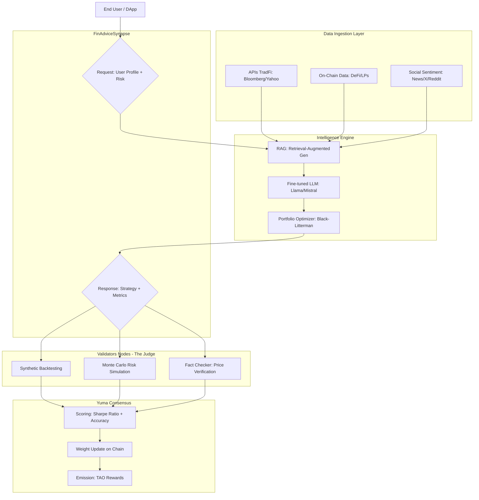

# FinAdvisor AI

## 1. Introduction
In today's financial system, high-quality, personalized advice is expensive, opaque, and centralized. The **FinAdvisor AI** Subnet will be created to break down these barriers, leveraging Bittensor's incentive network to build the world's most powerful, private, and distributed financial intelligence engine.

Unlike generic language models, this subnetwork will be specifically designed to process real-time market data, individual risk profiles, and long-term goals, transforming raw data into actionable, personalized strategies.

## 2. Vision
Our vision is to establish a global standard where financial advice does not depend on a banking institution, but on a decentralized network of expert nodes that compete to offer the best possible recommendation.

### Fundamental Pillars
- **Decentralization of Wisdom**: We don't rely on a single algorithm. The subne incentivizes hundreds of miners to develop specialized models in different niches (crypto, traditional stocks, tax optimization, savings management).
- **Extreme Personalization**: AI doesn't just analyze the market; it understands the user's context (age, risk tolerance, goals) to generate a unique plan, not a generic, template-based response.
- **Privacy by Design**: By operating on a decentralized infrastructure, we seek to integrate computing methods that protect the user's identity and assets, ensuring that the advice is private.
- **Neutrality and Incentives**: Thanks to Bittensor's consensus mechanism, miners are rewarded only for the accuracy and usefulness of their advice, eliminating the conflicts of interest common in traditional advisors that charge commissions for specific products.

_While other subnets focus on text or image generation, FinAdvisor AI focuses on real economic utility. We are building the intelligence layer that will power the next generation of DeFi applications and wealth management platforms._

## 3. Incentive Mechanism: Multidimensional Performance Evaluation
The goal is to reward miners who generate financial advice with the best balance between **expected return and risk management**.

### A. The Role of Validators
Validators don't just verify text; they act as "Market Simulators." Their function is to subject miners' recommendations to three critical tests:
1. **Synthetic Backtesting**: The validator takes the miner's recommendation (e.g., "Buy this mix of assets") and runs it against real historical data to see how it would have performed under stress scenarios (such as the 2020 or 2022 crashes).
2. **Profile Consistency**: If the user requested a "Conservative" profile, but the miner suggests highly volatile assets to inflate returns, the validator drastically penalizes the score.
3. **Correlation Analysis**: Miners who simply "copy" responses from other models (such as GPT-4) without providing added value or up-to-date on-chain or financial data are penalized.

### B. Scoring Metrics
The reward (in TAO) that a miner receives is calculated using a function that balances these variables:

| Metric | Definition | Weight in the Incentive |
|----------|----------|----------|
| **Optimized Sharpe Ratio**    | Relationship between expected return and assumed risk.   | **40%**  |
| **Predictive Accuracy**    | Accuracy in predicting short/medium term market trends.   | **30%**   |
| **Compliance with Restrictions**    | How well does the response fit the user's risk limits   | **20%**  |
| **Latency**    | Speed ​​of response (crucial for real-time financial decisions).   | **10**   |

### C. Reward Cycle
1. **Query**: A validator submits a "Case Study" (e.g., 30-year-old investor, $10,000 USD, medium risk, 5-year horizon).
2. **Inference**: Miners generate a custom strategy and a technical justification.
3. **Verification**: Validators execute the strategy in a simulated environment and compare the generated alpha (extra value) to a base index (e.g., S&P 500 or BTC/ETH).
4. **Issuance**: Miners with the best risk-relative alpha receive the largest share of the subnetwork's issuance.

### D. Fraud Protection (Anti-Sybil)
To prevent miners from giving random, seemingly good-sounding tips, the subnet will implement a Cross-Verification Mechanism:
- If a miner suggests a non-existent asset or manipulates price data, they are instantly flagged by validators.
- A minimum stake is required to mine, ensuring that participants have "skin in the game".

This structure transforms the subnet into a "Living Strategies Lab". The world's best trading and wealth management algorithms will compete here to win.

## 4. Technical Architecture: The "Brain"

For this subnet to be functional and competitive within the Bittensor ecosystem, the technical architecture must go beyond a simple chatbot. It needs to be a real-time financial data infrastructure combined with specialized large-scale language models (LLMs).

The architecture is divided into four critical layers that ensure that financial advice is accurate, secure, and verified.

### Layers 
#### A. Data Oracle Layer
Unlike a standard LLM that uses static data, miners in this subnet must feed their models with "Market Truth" sources:
- **Financial APIs**: Integration with Bloomberg, Reuters, or Yahoo Finance for traditional markets (Stocks, Bonds, ETFs).
- **On-Chain Indexers**: Real-time data from DeFi protocols (Uniswap, Aave, Lido) to capture yields (APY) and liquidity.
- **Sentiment Analysis**: News and social media scrapers to measure market fear or euphoria (Fear & Greed Index).

### B. Intelligence Engine
Each miner operates a technology stack that includes:
- **Fine-tuned LLM**: Models like Llama-3 or Mistral, specifically retrained with financial literature, quarterly reports, and investment strategies.
- **RAG (Retrieval-Augmented Generation)**: The miner doesn't "guess" the price; it uses RAG to query its fresh database before generating a recommendation.
- **Portfolio Optimization Module**: Mathematical algorithms (such as Modern Portfolio Theory or Black-Litterman) that translate the AI's input into a precise percentage allocation of assets.

### C. Communication Protocol
In our subnetwork, the _FinAdviceSynapse_ would contain:
- **Inputs**: user_profile (age, capital, risk), market_context (bullish/bearish), constraints (e.g., "I don't want crypto" or "only green investments").
- **Outputs**: allocation_strategy (list of assets), risk_metrics (VaR - Value at Risk), and reasoning (the logic behind the advice).

### D. Validation and Consensus Layer
Validators run "Financial Judgment" software that performs the following:
- **Fact Check**: Is the asset price mentioned by the miner accurate at this moment?
- **Monte Carlo Simulator**: The validator runs thousands of random simulations of the miner's strategy to assess its probability of success or catastrophic failure.
- **Proof of Strategy**: A cryptographic mechanism that ensures the miner is not simply forwarding another miner's response (copy prevention).

### Diagram

### Pipeline
1. **Request**: The Validator sends a challenge (e.g., "Design a retirement plan for a 40-year-old user in a high-inflation environment").
2. **Processing**: The Miner consults their data sources, runs their optimization model, and drafts the strategy.
3. **Evaluation**: The Validator compares the strategy against a benchmark (e.g., Did it outperform the risk-adjusted S&P 500?).
4. **Consensus**: The Validators reach a consensus on which miners contributed the most value, and the weights on the Bittensor blockchain are updated.

### Technology Stack
This stack is suggested, as it is at the discretion of the miners, as long as it complies with the subnet standards:
- **Language**: Python.
- **AI Framework**: PyTorch / HuggingFace Transformers.
- **Vector Database**: Pinecone or Milvus (for the financial news RAG).
- **Infrastructure**: Docker + Kubernetes for scaling mining nodes.

