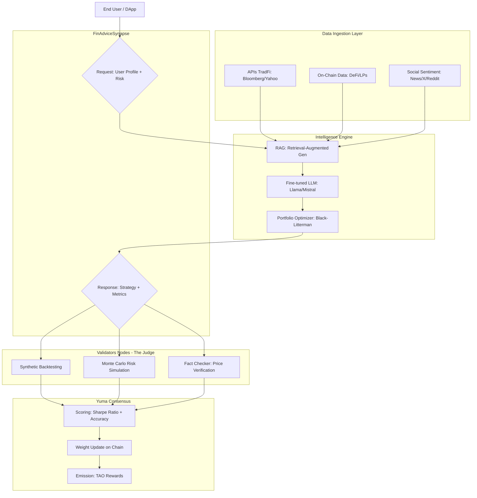

# FinMatrix

In a global ecosystem where the complexity of TradFi and DeFi markets has surpassed the analytical capacity of the average human advisor, FinMatrix emerges as Bittensor's first subnetwork dedicated to democratizing financial 'alpha'. Our architecture doesn't just generate recommendations; it orchestrates a global competition of specialized language models and portfolio optimization algorithms to deliver personalized, private, and mathematically validated financial advice.

## 1. Introduction
In today's financial system, high-quality, personalized advice is expensive, opaque, and centralized. The **FinMatrix** Subnet will be created to break down these barriers, leveraging Bittensor's incentive network to build the world's most powerful, private, and distributed financial intelligence engine.

Unlike generic language models, this subnet will be specifically designed to process real-time market data, individual risk profiles, and long-term goals, transforming raw data into actionable, personalized strategies.

## 2. Vision
Our vision is to establish a global standard where financial advice does not depend on a banking institution, but on a decentralized network of expert nodes that compete to offer the best possible recommendation.

### Fundamental Pillars
- **Decentralization of Wisdom**: We don't rely on a single algorithm. The subne incentivizes hundreds of miners to develop specialized models in different niches (crypto, traditional stocks, tax optimization, savings management).
- **Extreme Personalization**: AI doesn't just analyze the market; it understands the user's context (age, risk tolerance, goals) to generate a unique plan, not a generic, template-based response.
- **Privacy by Design**: By operating on a decentralized infrastructure, we seek to integrate computing methods that protect the user's identity and assets, ensuring that the advice is private.
- **Neutrality and Incentives**: Thanks to Bittensor's consensus mechanism, miners are rewarded only for the accuracy and usefulness of their advice, eliminating the conflicts of interest common in traditional advisors that charge commissions for specific products.

_While other subnets focus on text or image generation, FinMatrix focuses on real economic utility. We are building the intelligence layer that will power the next generation of DeFi applications and wealth management platforms._

## 3. Incentive Mechanism: Multidimensional Performance Evaluation
The goal is to reward miners who generate financial advice with the best balance between **expected return and risk management**.

### A. The Role of Validators
Validators don't just verify text; they act as "Market Simulators." Their function is to subject miners' recommendations to three critical tests:
1. **Synthetic Backtesting**: The validator takes the miner's recommendation (e.g., "Buy this mix of assets") and runs it against real historical data to see how it would have performed under stress scenarios (such as the 2020 or 2022 crashes).
2. **Profile Consistency**: If the user requested a "Conservative" profile, but the miner suggests highly volatile assets to inflate returns, the validator drastically penalizes the score.
3. **Correlation Analysis**: Miners who simply "copy" responses from other models (such as GPT-4) without providing added value or up-to-date on-chain or financial data are penalized.

### B. Scoring Metrics
The reward (in TAO) that a miner receives is calculated using a function that balances these variables:

| Metric | Definition | Weight in the Incentive |
|----------|----------|----------|
| **Optimized Sharpe Ratio**    | Relationship between expected return and assumed risk.   | **40%**  |
| **Predictive Accuracy**    | Accuracy in predicting short/medium term market trends.   | **30%**   |
| **Compliance with Restrictions**    | How well does the response fit the user's risk limits   | **20%**  |
| **Latency**    | Speed ​​of response (crucial for real-time financial decisions).   | **10**   |

### C. Reward Cycle
1. **Query**: A validator submits a "Case Study" (e.g., 30-year-old investor, $10,000 USD, medium risk, 5-year horizon).
2. **Inference**: Miners generate a custom strategy and a technical justification.
3. **Verification**: Validators execute the strategy in a simulated environment and compare the generated alpha (extra value) to a base index (e.g., S&P 500 or BTC/ETH).
4. **Issuance**: Miners with the best risk-relative alpha receive the largest share of the subnet's issuance.

### D. Fraud Protection (Anti-Sybil)
To prevent miners from giving random, seemingly good-sounding tips, the subnet will implement a Cross-Verification Mechanism:
- If a miner suggests a non-existent asset or manipulates price data, they are instantly flagged by validators.
- A minimum stake is required to mine, ensuring that participants have "skin in the game".

This structure transforms the subnet into a "Living Strategies Lab". The world's best trading and wealth management algorithms will compete here to win.

## 4. Technical Architecture: The "Brain"

For this subnet to be functional and competitive within the Bittensor ecosystem, the technical architecture must go beyond a simple chatbot. It needs to be a real-time financial data infrastructure combined with specialized large-scale language models (LLMs).

The architecture is divided into four critical layers that ensure that financial advice is accurate, secure, and verified.

### Layers 
#### A. Data Oracle Layer
Unlike a standard LLM that uses static data, miners in this subnet must feed their models with "Market Truth" sources:
- **Financial APIs**: Integration with Bloomberg, Reuters, or Yahoo Finance for traditional markets (Stocks, Bonds, ETFs).
- **On-Chain Indexers**: Real-time data from DeFi protocols (Uniswap, Aave, Lido) to capture yields (APY) and liquidity.
- **Sentiment Analysis**: News and social media scrapers to measure market fear or euphoria (Fear & Greed Index).

### B. Intelligence Engine
Each miner operates a technology stack that includes:
- **Fine-tuned LLM**: Models like Llama-3 or Mistral, specifically retrained with financial literature, quarterly reports, and investment strategies.
- **RAG (Retrieval-Augmented Generation)**: The miner doesn't "guess" the price; it uses RAG to query its fresh database before generating a recommendation.
- **Portfolio Optimization Module**: Mathematical algorithms (such as Modern Portfolio Theory or Black-Litterman) that translate the AI's input into a precise percentage allocation of assets.

### C. Communication Protocol
In our subnet, the _FinAdviceSynapse_ would contain:
- **Inputs**: user_profile (age, capital, risk), market_context (bullish/bearish), constraints (e.g., "I don't want crypto" or "only green investments").
- **Outputs**: allocation_strategy (list of assets), risk_metrics (VaR - Value at Risk), and reasoning (the logic behind the advice).

### D. Validation and Consensus Layer
Validators run "Financial Judgment" software that performs the following:
- **Fact Check**: Is the asset price mentioned by the miner accurate at this moment?
- **Monte Carlo Simulator**: The validator runs thousands of random simulations of the miner's strategy to assess its probability of success or catastrophic failure.
- **Proof of Strategy**: A cryptographic mechanism that ensures the miner is not simply forwarding another miner's response (copy prevention).

### Diagram

### Pipeline
1. **Request**: The Validator sends a challenge (e.g., "Design a retirement plan for a 40-year-old user in a high-inflation environment").
2. **Processing**: The Miner consults their data sources, runs their optimization model, and drafts the strategy.
3. **Evaluation**: The Validator compares the strategy against a benchmark (e.g., Did it outperform the risk-adjusted S&P 500?).
4. **Consensus**: The Validators reach a consensus on which miners contributed the most value, and the weights on the Bittensor blockchain are updated.

### Technology Stack
This stack is suggested, as it is at the discretion of the miners, as long as it complies with the subnet standards:
- **Language**: Python.
- **AI Framework**: PyTorch / HuggingFace Transformers.
- **Vector Database**: Pinecone or Milvus (for the financial news RAG).
- **Infrastructure**: Docker + Kubernetes for scaling mining nodes.

## 5. Business Logic & Market Rationale
The success of a subnet on Bittensor depends on its ability to resolve a market inefficiency through crypto-economic incentives. FinMatrix addresses the gap between big data analytics and personalized financial execution.

### A. The Inefficiency of the Current Market
Today, financial advice suffers from three critical flaws that our subnet addresses:
1. Agency Bias: Traditional advisors often recommend products that generate kickbacks for them. At FinMatrix, miners only earn TAO if their strategy is mathematically superior and validated, eliminating conflicts of interest.
2. Information Latency: While a human advisor reads a quarterly report, the subnet processes thousands of on-chain and off-chain data points in seconds.
3. Barrier to Entry: Access to "family office" strategies requires millions of dollars in capital. Our subnet allows any wallet, regardless of size, to access institutional-level intelligence.

### B. Value Generation and Flywheel
The value of the subnetwork grows through a positive feedback loop:
- API Demand: Fintech companies and DeFi protocols buy TAO to query the subnetwork (locking up supply and increasing the token's value).
- Output Quality: Higher TAO rewards attract better miners (quants and data scientists) to the network, refining the algorithms.
- Competitive Moat: The history of validations and continuous training on market data create a "collective memory" that is impossible for a single private company to replicate.

### C. Comparative Analysis
| Feature | Traditional Advisor / Bank | Robo-Advisors (Web2) | FinMatrix|
|----------|----------|----------|----------|
| **Personalization**    | High (but expensive) | Low (based on surveys)   | **Ultra-High (data/AI based)**  |
| **Transparency**    | Opaque (black box) | Closed algorithms   | **Auditable (on the blockchain)**   |
| **Scalability**    | Limited by humans | High   | **Infinite (Distributed Network)**  |
| **Cost**    | Commissions of 1-2% per year | Fixed commissions   | **Based on API consumption**   |

## 6. Go-To-Market Strategy
Our deployment is divided into three strategic phases designed to maximize the network effect and ensure the liquidity of knowledge within the subnet.

### Phase 1: The "Bootstrapping" of Intelligence
The goal is to attract top AI developers and quantitative analysts (quants).
- **Miner Incentives**: Launch of an open-source "Miner Toolkit" that includes basic integrations with financial APIs to lower the technical barrier to entry.
- **Testnet Competitions**: Portfolio prediction and optimization tournaments with prizes to identify and recruit the top 50 initial miners.
- **Academic Partnerships**: Alliances with quantitative computing labs to use the subnet as a testing ground for reinforcement learning models applied to finance.

### Phase 2: Integration with the Web3 Ecosystem
Once the network generates quality advice, we seek the first institutional users of the "demand."
- **DeFi SDK**: Launch of a development kit so that Yield Farming and Lending protocols (such as Aave or Curve) can integrate the subnet's recommendations directly into their vaults.
- **Governance as a Service**: Offering DAOs an automated "Treasury Advisor" service, where the subnet issues monthly asset optimization reports.
- **Wallet Integration**: Partnerships with wallets (such as Metamask or Rabby) to display a financial "Health Score" powered by the subnet.

### Phase 3: Expansion into the TradFi Market
The ultimate goal is to bridge the gap with traditional finance.
- **B2B API for Fintechs**: Offer subnet intelligence to neobanks and Web2 robo-advisors as a white-label AI service for their end customers.
- **Compliance and Regulation**: Develop validation layers that meet core financial standards (such as MiFID II risk profiles in Europe) to facilitate institutional adoption.
- **Performance Marketing**: Publish a public "FinMatrix Index" comparing subnet performance against the S&P 500 and other benchmarks, demonstrating the alpha generated by decentralization.

## 7. Use Cases
The subnet acts as a Financial Intelligence API that any developer or institution can query by paying a small fee in TAO.

### A. Consumer Fintech: The Personal "Financial Co-pilot"
Neobank banking apps (like Revolut or Nubank) can connect their interface to the subnet to offer "Private Banking"-level advice to users with small amounts of capital.
- **Scenario**: A user receives their salary. The app consults the subnet: "Design a plan to save 15%, optimizing taxes and diversifying into low-risk assets."
- **Value**: The user receives a strategy validated by hundreds of competing models, not by a biased human advisor.

### B. DeFi Protocols: Autonomous Treasury Management
DAOs (Decentralized Autonomous Organizations) often have multimillion-dollar treasuries "sitting" in stablecoins without generating efficient returns or assuming unseen risks.
- **Scenario**: A DAO requests the subnet: "Rebalance our treasury to achieve a 5% real APY, limiting exposure to protocols less than one year old."
- **Value**: Miners compete to find the best yield farms and lending protocols with the lowest technical risk.

### C. Wealth Management: Advisor Support Tool
Human financial advisors can use the subnet to generate draft strategies and in-depth risk analyses in seconds.
- **Scenario**: An advisor uploads a complex client profile. The subnet processes thousands of variables and returns a Value at Risk (VaR) report and a portfolio optimization proposal.
- **Value**: Increases advisor productivity and reduces human error through cross-checking across the network.

### D. Sentiment Analysis and Black Swan Prediction
Due to its real-time data architecture, the subnet can act as an early warning system.
- **Scenario**: In the event of a sudden geopolitical event, the subnet detects anomalies in sentiment and on-chain flows, automatically suggesting hedging strategies to protect capital.
-**Value**: Prevention of catastrophic losses through distributed collective intelligence.

## 8. Conclusion: The New Standard of Financial Sovereignty
The FinMatrix subnet is not simply an analytical tool; it is the first step toward universal financial autonomy.

Historically, high-precision financial advice has been a wall separating elites from the rest of the world, protected by high costs and institutional opacity. Today, by merging Bittensor's competitive incentive system with decentralized artificial intelligence, we are tearing down that wall.

**Why now?**
We are at a tipping point where the complexity of the markets (TradFi and DeFi) exceeds the processing capacity of any human advisor or static centralized model. **FinMatrix** offers a solution that is:
- **Incorruptible**: Incentives are aligned solely with accuracy and performance.
- **Unreachable by censorship**: A global network of nodes operating without a single point of failure.
- **Evolutionary**: Thanks to Bittensor's consensus mechanism, the subnetwork's intelligence never stagnates; It improves every second as miners compete for the best alpha.

**The Call to Action**
We invite validators to ensure the integrity of this new wealth oracle and miners to demonstrate that collective intelligence can outperform any Wall Street hedge fund.

**"The future of finance is not a bank, it's an open intelligence network that works for everyone."**
